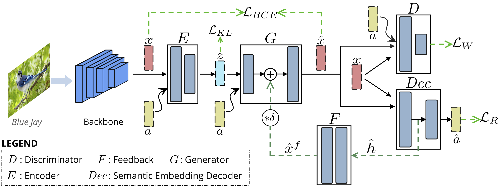
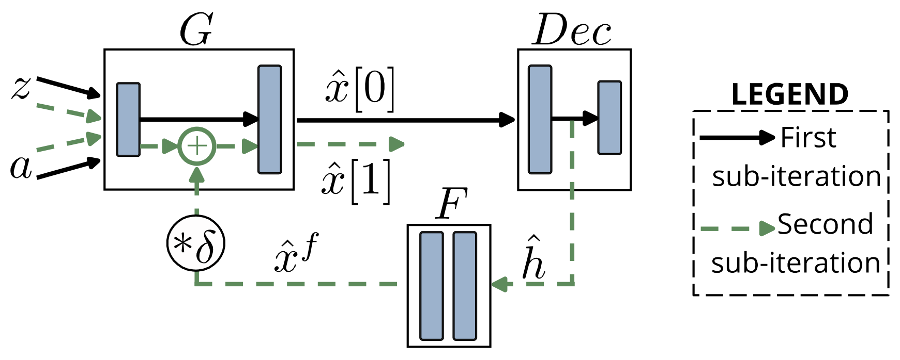
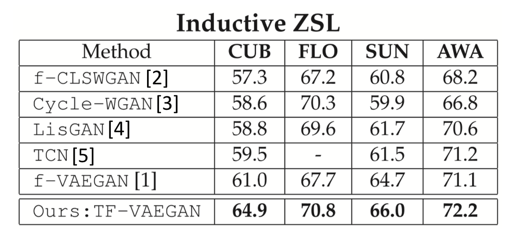

[](https://paperswithcode.com/sota/generalized-zero-shot-learning-on-awa2?p=latent-embedding-feedback-and-discriminative)
[](https://paperswithcode.com/sota/zero-shot-learning-on-awa2?p=latent-embedding-feedback-and-discriminative)
[](https://paperswithcode.com/sota/generalized-zero-shot-learning-on-cub-200?p=latent-embedding-feedback-and-discriminative)
[](https://paperswithcode.com/sota/zero-shot-learning-on-cub-200-2011?p=latent-embedding-feedback-and-discriminative)
[](https://paperswithcode.com/sota/generalized-zero-shot-learning-on-oxford-102-1?p=latent-embedding-feedback-and-discriminative)
[](https://paperswithcode.com/sota/zero-shot-learning-on-oxford-102-flower?p=latent-embedding-feedback-and-discriminative)
[](https://paperswithcode.com/sota/generalized-zero-shot-learning-on-sun?p=latent-embedding-feedback-and-discriminative)
[](https://paperswithcode.com/sota/zero-shot-learning-on-sun-attribute?p=latent-embedding-feedback-and-discriminative)


# Latent Embedding Feedback and Discriminative Features for Zero-Shot Classification (ECCV 2020)

#### [Sanath Narayan](https://scholar.google.com/citations?user=Bx7EFGoAAAAJ&hl=en)<sup>\*</sup>, [Akshita Gupta](https://scholar.google.com/citations?user=G01YeI0AAAAJ&hl=en)<sup>\*</sup>, [Fahad Shahbaz Khan](https://scholar.google.es/citations?user=zvaeYnUAAAAJ&hl=en), [Cees G. M. Snoek](https://scholar.google.com/citations?hl=en&user=0uKdbscAAAAJ&view_op), [Ling Shao](https://scholar.google.com/citations?user=z84rLjoAAAAJ&hl=en) ####

(* denotes equal contribution)

**Paper:** https://arxiv.org/abs/2003.07833

**Video Presentation:** [Short summary](https://youtu.be/Jq0glS1DwGg) , [Overview](https://youtu.be/tNmyfKVUIpo)

**Finetuned features:** https://drive.google.com/drive/folders/13-eyljOmGwVRUzfMZIf_19HmCj1yShf1?usp=sharing

**Webpage:** https://akshitac8.github.io/tfvaegan/

Zero-shot learning strives to classify unseen categories for which no data is available during training. In the generalized variant, the
test samples can further belong to seen or unseen categories. The stateof-the-art relies on Generative Adversarial Networks that synthesize unseen class features by leveraging class-specific semantic embeddings. During training, they generate semantically consistent features, but discard this constraint during feature synthesis and classification. We propose to enforce semantic consistency at all stages of (generalized) zero-shot learning: training, feature synthesis and classification. We first introduce a feedback loop, from a semantic embedding decoder, that iteratively refines the generated features during both the training and feature synthesis stages. The synthesized features together with their corresponding latent embeddings from the decoder are then transformed into discriminative features and utilized during classification to reduce ambiguities among categories. Experiments on (generalized) zero-shot object and action classification reveal the benefit of semantic consistency and iterative feedback, outperforming existing methods on six zero-shot learning benchmarks

## **Overall Architecture:** 

<p align="center">
  
  <br/>
  <br/>
  <b> Overall Framework for TF-Vaegan </b>
</p>

<table>
  <tr>
    <td>  </td>
    <td>  </td>
  </tr>
  <tr >
    <td><p align="center"> <b> A feedback module, which utilizes the auxiliary decoder during both training and feature synthesis stages for improving semantic quality of synthesized feature.</b></p></td>
    <td><p align="center"><b> A discriminative feature transformation that utilizes the auxiliary decoder during the classification stage for enhancing zero-shot classification.</b></p></td>
  </tr>
</table>

## Installation
The codebase is built on PyTorch 0.3.1 and tested on Ubuntu 16.04 environment (Python3.6, CUDA9.0, cuDNN7.5).

For installing, follow these intructions
```
conda env create -f environment.yml
conda activate pytorch0.3.1
```

## Directory Structure

### zero-shot-images
* [data/](./zero-shot-images/data)  
* [image-scripts/](./zero-shot-images/image-scripts)  
  * [run_awa_tfvaegan.py](./zero-shot-images/image-scripts/run_awa_tfvaegan.py)  
  * [run_cub_tfvaegan.py](./zero-shot-images/image-scripts/run_cub_tfvaegan.py)  
  * [run_flo_tfvaegan.py](./zero-shot-images/image-scripts/run_flo_tfvaegan.py)  
  * [run_sun_tfvaegan.py](./zero-shot-images/image-scripts/run_sun_tfvaegan.py)  
* [classifier.py](./zero-shot-images/classifier.py)  
* [config.py](./zero-shot-images/config.py)  
* [model.py](./zero-shot-images/model.py)  
* [train_tfvaegan_inductive.py](./zero-shot-images/train_tfvaegan_inductive.py)  
* [util.py](./zero-shot-images/util.py)

### zero-shot-actions  
  
* [action-scripts/](./zero-shot-actions/action-scripts)  
  * [run_hmdb51.py](./zero-shot-actions/action-scripts/run_hmdb51_tfvaegan.py)  
  * [run_ucf101.py](./zero-shot-actions/action-scripts/run_ucf101_tfvaegan.py)  
* [data/](./zero-shot-actions/data)  
* [classifier.py](./zero-shot-actions/classifier.py)  
* [classifier_entropy.py](./zero-shot-actions/classifier_entropy.py)  
* [config.py](./zero-shot-actions/config.py)  
* [model.py](./zero-shot-actions/model.py)  
* [train_tfvaegan.py](./zero-shot-actions/train_tfvaegan.py)  
* [util.py](./zero-shot-actions/util.py)


## Training

### Zero-Shot Image Classification
```
cd zero-shot-images
CUB : python image-scripts/run_cub_tfvaegan.py
AWA : python image_scripts/run_awa_tfvaegan.py
FLO : python image_scripts/run_flo_tfvaegan.py
SUN : python image_scripts/run_sun_tfvaegan.py

```
### Zero-Shot Action Classification
```
cd zero-shot-actions
HMDB51 : python action_scripts/run_hmdb51_tfvaegan.py
UCF101 : python action_scripts/run_ucf101_tfvaegan.py

```

## Results

<table>
  <tr>
    <td>  </td>
    <td>  </td>
  </tr>
</table>

## Citation:

If you find this useful, please cite our work as follows:
```
@inproceedings{narayan2020latent,
	title={Latent Embedding Feedback and Discriminative Features for Zero-Shot Classification},
	author={Narayan, Sanath and Gupta, Akshita and Khan, Fahad Shahbaz and Snoek, Cees GM and Shao, Ling},
	booktitle={ECCV},
	year={2020}
}
```

## Upcoming Updates
1. Collab Training file
2. Demo file for running inference on your own data
3. pytorch version update from 0.3.1 -> 1.1.0

Please do click on the watch icon to get notified for the new upcoming changes.
