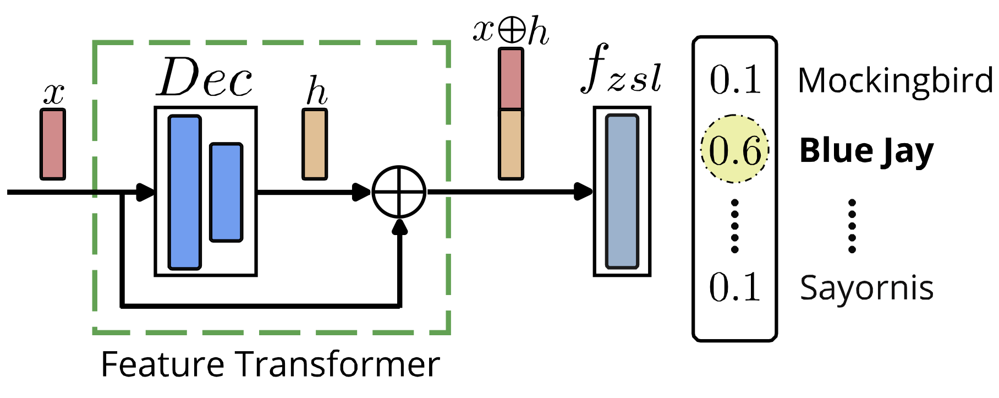

[](https://paperswithcode.com/sota/generalized-zero-shot-learning-on-awa2?p=latent-embedding-feedback-and-discriminative)
[](https://paperswithcode.com/sota/zero-shot-learning-on-awa2?p=latent-embedding-feedback-and-discriminative)
[](https://paperswithcode.com/sota/generalized-zero-shot-learning-on-cub-200?p=latent-embedding-feedback-and-discriminative)
[](https://paperswithcode.com/sota/zero-shot-learning-on-cub-200-2011?p=latent-embedding-feedback-and-discriminative)
[](https://paperswithcode.com/sota/generalized-zero-shot-learning-on-oxford-102-1?p=latent-embedding-feedback-and-discriminative)
[](https://paperswithcode.com/sota/zero-shot-learning-on-oxford-102-flower?p=latent-embedding-feedback-and-discriminative)
[](https://paperswithcode.com/sota/generalized-zero-shot-learning-on-sun?p=latent-embedding-feedback-and-discriminative)
[](https://paperswithcode.com/sota/zero-shot-learning-on-sun-attribute?p=latent-embedding-feedback-and-discriminative)


# Latent Embedding Feedback and Discriminative Features for Zero-Shot Classification (ECCV 2020)

#### [Sanath Narayan](https://scholar.google.com/citations?user=Bx7EFGoAAAAJ&hl=en)<sup>\*</sup>, [Akshita Gupta](https://scholar.google.com/citations?user=G01YeI0AAAAJ&hl=en)<sup>\*</sup>, [Fahad Shahbaz Khan](https://scholar.google.es/citations?user=zvaeYnUAAAAJ&hl=en), [Cees G. M. Snoek](https://scholar.google.com/citations?hl=en&user=0uKdbscAAAAJ&view_op), [Ling Shao](https://scholar.google.com/citations?user=z84rLjoAAAAJ&hl=en) ####

(* denotes equal contribution)

**Paper:** https://arxiv.org/abs/2003.07833

**Video Presentation:** [Short summary](https://youtu.be/Jq0glS1DwGg) , [Overview](https://youtu.be/tNmyfKVUIpo)

**Finetuned features:** https://drive.google.com/drive/folders/13-eyljOmGwVRUzfMZIf_19HmCj1yShf1?usp=sharing

**Webpage:** https://akshitac8.github.io/tfvaegan/

Zero-shot learning strives to classify unseen categories for which no data is available during training. In the generalized variant, the
test samples can further belong to seen or unseen categories. The stateof-the-art relies on Generative Adversarial Networks that synthesize unseen class features by leveraging class-specific semantic embeddings. During training, they generate semantically consistent features, but discard this constraint during feature synthesis and classification. We propose to enforce semantic consistency at all stages of (generalized) zero-shot learning: training, feature synthesis and classification. We first introduce a feedback loop, from a semantic embedding decoder, that iteratively refines the generated features during both the training and feature synthesis stages. The synthesized features together with their corresponding latent embeddings from the decoder are then transformed into discriminative features and utilized during classification to reduce ambiguities among categories. Experiments on (generalized) zero-shot object and action classification reveal the benefit of semantic consistency and iterative feedback, outperforming existing methods on six zero-shot learning benchmarks

## **Overall Architecture:** 

<p align="center">
  
  <br/>
  <br/>
  <b> Overall Framework for TF-Vaegan </b>
</p>

<table>
  <tr>
    <td>  </td>
    <td>  </td>
  </tr>
  <tr >
    <td><p align="center"> <b> A feedback module, which utilizes the auxiliary decoder during both training and feature synthesis stages for improving semantic quality of synthesized feature.</b></p></td>
    <td><p align="center"><b> A discriminative feature transformation that utilizes the auxiliary decoder during the classification stage for enhancing zero-shot classification.</b></p></td>
  </tr>
</table>

## Prerequisites
+ Python 3.6
+ Pytorch 0.3.1
+ torchvision 0.2.0
+ h5py 2.10
+ scikit-learn 0.22.1
+ scipy=1.4.1
+ numpy 1.18.1
+ pip 20.0.2

## Data preparation

### Standard ZSL and GZSL datasets

Download CUB, AWA, FLO and SUN features from the drive link shared below.
```
link: https://drive.google.com/drive/folders/16Xk1eFSWjQTtuQivTogMmvL3P6F_084u?usp=sharing

```
Download UCF101 and HMDB51 features from the drive link shared below.
```
link: https://drive.google.com/drive/folders/1pNlnL3LFSkXkJNkTHNYrQ3-Ie4vvewBy?usp=sharing

```
Extract them in the `datasets` folder.

### Custom datasets

1. Download the custom dataset images in the datsets folder.
2. Use a pre-defined RESNET101 as feature extractor. For example, you can a have look [here](https://github.com/akshitac8/Generative_MLZSL/tree/main/datasets/extract_features)
3. Extract features from the pre-defined RESNET101 and save the features in the dictionary format with keys 'features', 'image_files', 'labels'.
4. Save the dictionary in a .mat format using,  
    ```
    import scipy.io as io
    io.savemat('temp',feat)
    ```

## Training

### Zero-Shot Image Classification
1. To train and evaluate ZSL and GZSL models on CUB, AWA, FLO and SUN, please run:
```
CUB : python scripts/run_cub_tfvaegan.py
AWA : python scripts/run_awa_tfvaegan.py
FLO : python scripts/run_flo_tfvaegan.py
SUN : python scripts/run_sun_tfvaegan.py

```
### Zero-Shot Action Classification
1. To train and evaluate ZSL and GZSL models on UCF101, HMDB51, please run:

```
cd zero-shot-actions
HMDB51 : python scripts/run_hmdb51_tfvaegan.py
UCF101 : python scripts/run_ucf101_tfvaegan.py

```

## Results

<table>
  <tr>
    <td>  </td>
    <td>  </td>
  </tr>
</table>

## Citation:

If you find this useful, please cite our work as follows:
```
@inproceedings{narayan2020latent,
	title={Latent Embedding Feedback and Discriminative Features for Zero-Shot Classification},
	author={Narayan, Sanath and Gupta, Akshita and Khan, Fahad Shahbaz and Snoek, Cees GM and Shao, Ling},
	booktitle={ECCV},
	year={2020}
}
```
